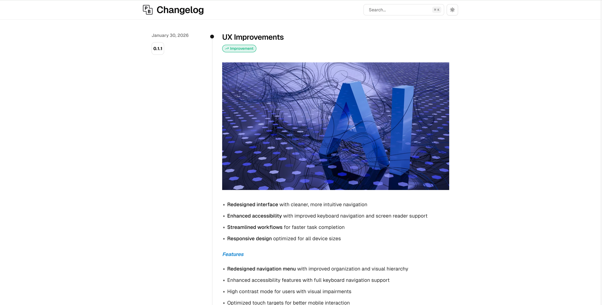
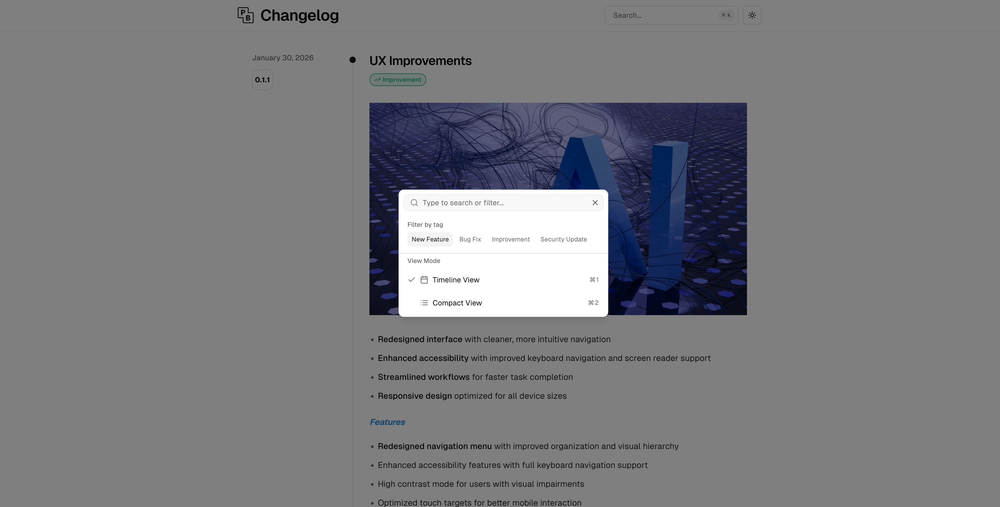
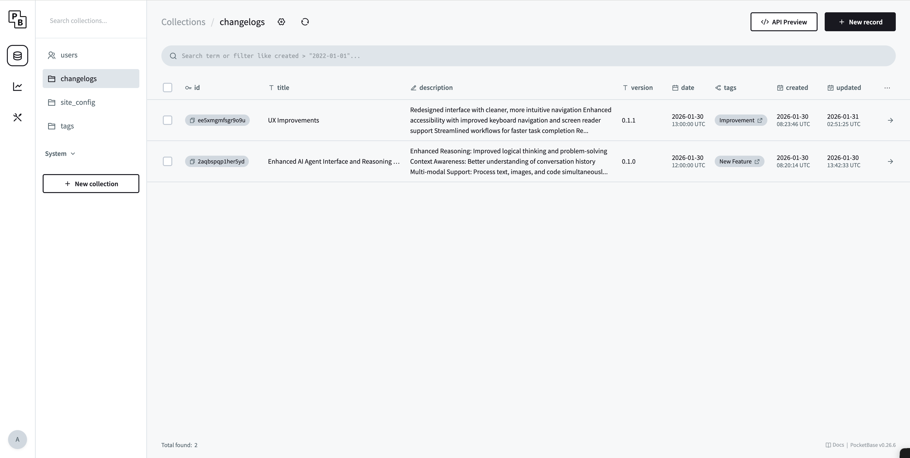
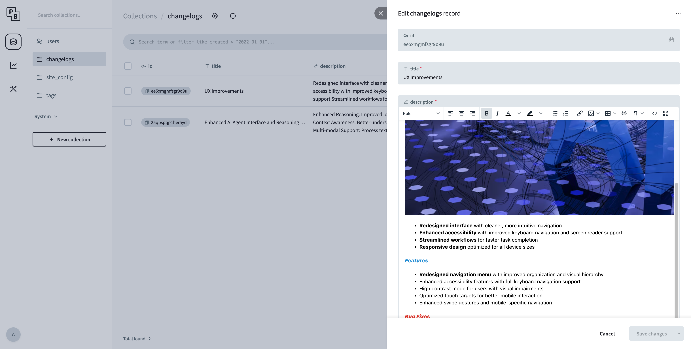

# Pulse - Changelog Management System

[](https://github.com/wylu1037/pulse)

A modern Changelog publishing system based on PocketBase + Next.js, supporting single-file deployment.

## Features

- ✨ **Modern UI** - Built with Next.js 15 + Tailwind CSS + shadcn/ui
- 🎯 **Full-featured** - Search, filtering, pagination, view switching
  
- 🌙 **Dark Mode** - System-sync or manual toggle
- 📱 **Responsive Design** - Optimized for both desktop and mobile
- 🚀 **Single-file Deployment** - One executable containing both frontend and backend
- 🔧 **Zero-config Backend** - Built-in admin interface by PocketBase

## Quick Start

### Development Environment

**Prerequisites**:

- Node.js 18+
- pnpm

**1. Download & Start Backend (PocketBase)**

```bash
# Download the binary for your OS
chmod +x setup.sh && ./setup.sh

# Start the service
./pocketbase serve
```

Migration will run automatically on the first start, creating all tables and initial data.  
Access http://localhost:8090/\_/ to create an admin account.

**2. Install Frontend Dependencies**

```bash
cd frontend
pnpm install
```

**3. Start the Frontend Development Server**

```bash
pnpm run dev
```

Visit http://localhost:3000 to see it in action.

### Production Deployment

Since the `build.sh` script has been removed, you can build manually:

**Manual Build**

```bash
# 1. Build Frontend
cd frontend
pnpm run build
cd ..

# 2. Deploy to PocketBase
rm -rf pb_public/*
cp -r frontend/out/* pb_public/

# 3. Start Service
./pocketbase serve --http="0.0.0.0:8090"
```

Now visit http://localhost:8090 to see the full application!

- Frontend: `http://localhost:8090`
- Backend: `http://localhost:8090/_/`

## User Guide

### Publishing a Changelog

1. Visit http://localhost:8090/\_/ and log in to the admin panel.
   
2. Go to the `changelogs` collection.
3. Click "New record" to create a new entry.
   
4. Fill in the fields:
   - **title**: Changelog title
   - **description**: Detailed description (supports Markdown)
   - **version**: Version number (e.g., v1.2.0)
   - **date**: Release date
   - **tags**: Select tags (multi-select supported)
5. Save, and it will appear on the frontend immediately.

### Managing Tags

You can manage tags in the `tags` collection:

- **name**: Tag name (e.g., "New Feature")
- **slug**: URL-friendly identifier (e.g., "new-feature")
- **color**: Hex color code (e.g., #3B82F6)
- **icon**: Lucide icon name (e.g., "Sparkles")
- **order**: Display order

## Tech Stack

- **Backend**: PocketBase v0.22.26 (Go + SQLite)
- **Frontend**: Next.js 15 + React 19
- **Styling**: Tailwind CSS 4 + shadcn/ui
- **Language**: TypeScript

## Project Structure

```
pulse/
├── pocketbase                # Executable (Generic/Downloaded)
├── setup.sh                  # Setup script for PocketBase
├── pb_migrations/            # Database migrations
├── pb_public/                # Frontend build artifacts
├── pb_data/                  # SQLite database
├── frontend/                 # Frontend source code
│   ├── app/                 # Next.js routes
│   ├── components/          # React components
│   ├── lib/                 # Utilities and API
│   └── public/              # Static assets
└── docs/                    # Design documentation
```

## FAQ

**Q: How do I back up my data?**  
A: Just copy the `pb_data/` directory.

**Q: How do I change the port?**  
A: Start like this: `./pocketbase serve --http="0.0.0.0:YOUR_PORT"`

**Q: How can the frontend connect to a custom backend address?**  
A: Set `NEXT_PUBLIC_PB_URL=https://your-api.com` in `frontend/.env.local`.

## License

MIT

## Acknowledgments

- Frontend template based on [magicuidesign/changelog-template](https://github.com/magicuidesign/changelog-template)
- Backend powered by [PocketBase](https://pocketbase.io/)
