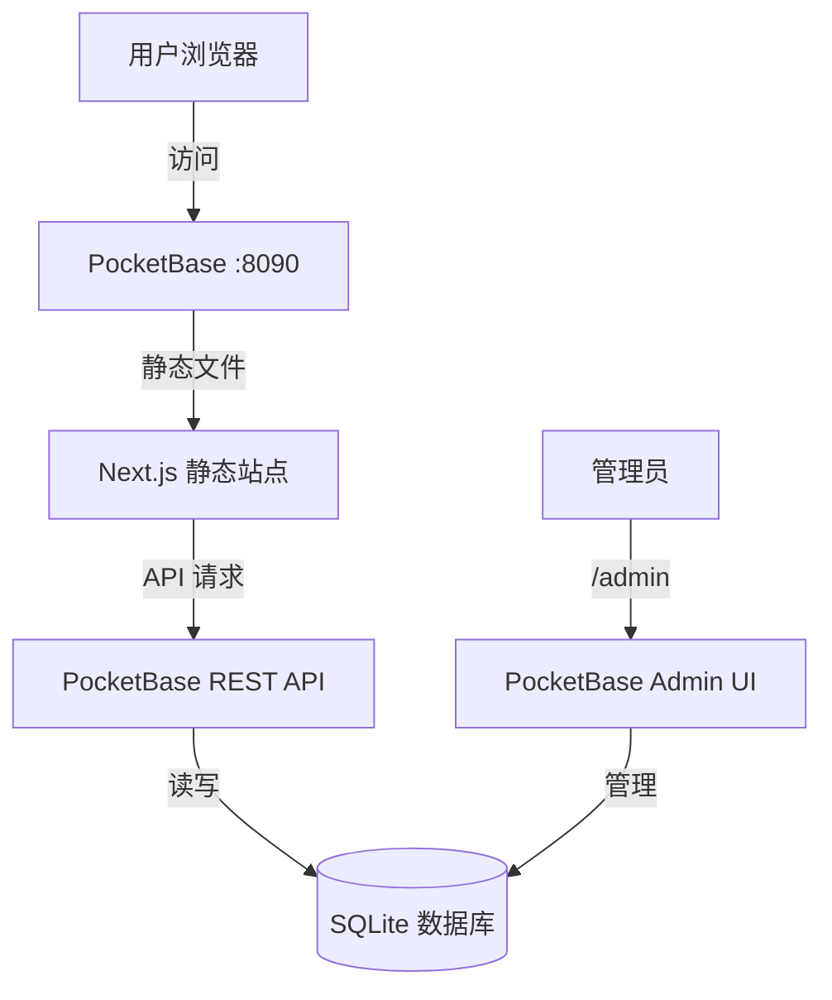
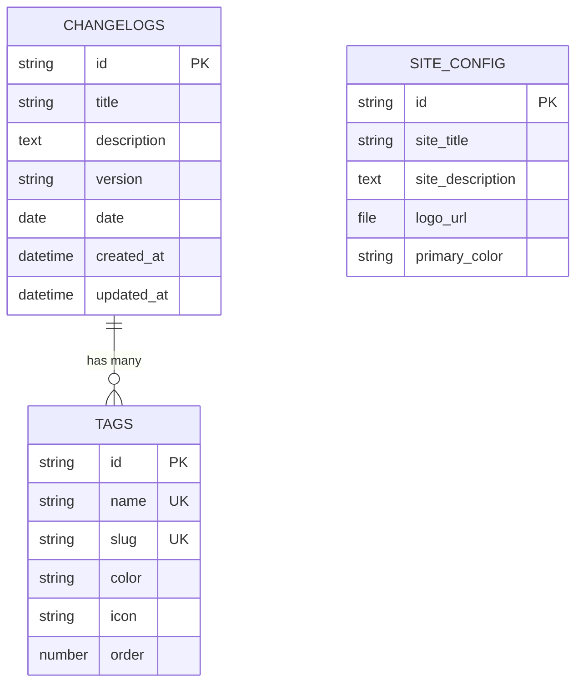

# Changelog 系统设计文档

**项目名称**: Pulse - 基于 PocketBase 的 Changelog 管理系统  
**设计日期**: 2026-01-30  
**设计版本**: v1.0

---

## 1. 项目概述

### 1.1 目标

开发一个带后台管理的 Changelog 发布系统，支持：

- 通过 PocketBase Admin UI 管理 changelog 条目
- 现代化的前端展示界面
- 最终打包成单个可执行文件，便于部署

### 1.2 技术选型

| 层级 | 技术栈                   | 说明                                                                                              |
| ---- | ------------------------ | ------------------------------------------------------------------------------------------------- |
| 后端 | PocketBase               | Go 编写，内置 SQLite + Admin UI + RESTful API                                                     |
| 前端 | Next.js 15               | 基于 [magicuidesign/changelog-template](https://github.com/magicuidesign/changelog-template) 改造 |
| 样式 | Tailwind CSS + shadcn/ui | 现代化组件库                                                                                      |
| 语言 | TypeScript               | 类型安全                                                                                          |
| 部署 | 静态导出 + PocketBase    | 单可执行文件                                                                                      |

### 1.3 功能范围（增强模式）

✅ **核心功能**

- Changelog 条目管理（标题、描述、版本号、日期、标签）
- 网站配置管理（标题、描述、Logo、主题色）
- 标签管理（预设标签列表）

✅ **前端功能**

- 分页加载（首屏 20 条，无限滚动）
- 搜索功能（客户端 + 服务端）
- 标签筛选
- 视图切换（时间线 ↔ 紧凑列表）
- 暗色模式

---

## 2. 系统架构

### 2.1 整体架构



### 2.2 部署架构

```
pocketbase (可执行文件 ~10MB)
├── pb_data/              # 数据存储目录
│   ├── data.db          # SQLite 数据库
│   └── storage/         # 上传的文件（Logo等）
├── pb_migrations/        # 数据库迁移文件
│   ├── 1234567890_created_changelogs.js
│   ├── 1234567891_created_tags.js
│   └── 1234567892_created_site_config.js
└── pb_public/           # 前端静态文件
    ├── _next/
    ├── index.html
    └── ...
```

**运行命令**: `./pocketbase serve`  
**访问地址**:

- 前端: `http://localhost:8090`
- 后台: `http://localhost:8090/_/`

---

## 3. 数据库设计

### 3.1 表结构

#### `changelogs` 表

| 字段        | 类型              | 必填 | 说明                        |
| ----------- | ----------------- | ---- | --------------------------- |
| id          | string (自动生成) | ✅   | 主键                        |
| title       | text              | ✅   | Changelog 标题              |
| description | editor            | ✅   | 富文本描述（支持 Markdown） |
| version     | text              | ✅   | 版本号（如 v1.2.0）         |
| date        | date              | ✅   | 发布日期                    |
| tags        | relation (多选)   | ❌   | 关联到 tags 表              |
| created_at  | datetime          | ✅   | 创建时间（自动）            |
| updated_at  | datetime          | ✅   | 更新时间（自动）            |

**索引**:

- `date DESC, created_at DESC` - 用于时间线排序

**API 规则**:

- 列表/详情: 公开访问（无需认证）
- 创建/更新/删除: 仅管理员

---

#### `tags` 表

| 字段  | 类型              | 必填 | 唯一 | 说明                               |
| ----- | ----------------- | ---- | ---- | ---------------------------------- |
| id    | string (自动生成) | ✅   | -    | 主键                               |
| name  | text              | ✅   | ✅   | 标签名称（如"新功能"）             |
| slug  | text              | ✅   | ✅   | URL 友好标识符（如 "new-feature"） |
| color | text              | ❌   | -    | 十六进制颜色代码（如 #3B82F6）     |
| icon  | text              | ❌   | -    | Lucide 图标名称（如 "Sparkles"）   |
| order | number            | ❌   | -    | 显示顺序（默认 0）                 |

**预设标签示例**:

```json
[
  {
    "name": "新功能",
    "slug": "new-feature",
    "color": "#3B82F6",
    "icon": "Sparkles"
  },
  { "name": "修复", "slug": "bug-fix", "color": "#EF4444", "icon": "Bug" },
  {
    "name": "改进",
    "slug": "improvement",
    "color": "#10B981",
    "icon": "TrendingUp"
  },
  {
    "name": "安全更新",
    "slug": "security",
    "color": "#F59E0B",
    "icon": "Shield"
  }
]
```

---

#### `site_config` 表

| 字段             | 类型          | 必填 | 说明               |
| ---------------- | ------------- | ---- | ------------------ |
| id               | string (固定) | ✅   | 主键（单记录表）   |
| site_title       | text          | ✅   | 网站标题           |
| site_description | text          | ✅   | 网站描述           |
| logo_url         | file          | ❌   | Logo 图片          |
| primary_color    | text          | ❌   | 主题色（十六进制） |

**说明**: 此表只有一条记录，用于存储全局配置。

---

### 3.2 数据关系



---

## 4. API 设计

### 4.1 核心 API 端点

PocketBase 自动生成 RESTful API，前端使用 PocketBase JavaScript SDK 调用。

#### 获取 Changelog 列表（分页）

```typescript
GET /api/collections/changelogs/records
  ?page=1
  &perPage=20
  &sort=-date,-created_at
  &expand=tags
  &filter=tags.slug~"bug-fix"  // 可选：标签筛选
```

**响应示例**:

```json
{
  "page": 1,
  "perPage": 20,
  "totalItems": 156,
  "totalPages": 8,
  "items": [
    {
      "id": "abc123",
      "title": "性能优化和 Bug 修复",
      "description": "## 主要改进\n- 优化首页加载速度\n- 修复登录问题",
      "version": "v2.1.0",
      "date": "2026-01-28",
      "expand": {
        "tags": [
          {
            "id": "tag1",
            "name": "改进",
            "slug": "improvement",
            "color": "#10B981"
          },
          {
            "id": "tag2",
            "name": "修复",
            "slug": "bug-fix",
            "color": "#EF4444"
          }
        ]
      },
      "created_at": "2026-01-28 10:00:00",
      "updated_at": "2026-01-28 10:00:00"
    }
  ]
}
```

---

#### 搜索 Changelog

```typescript
GET /api/collections/changelogs/records
  ?filter=title~"登录" || description~"登录"
  &expand=tags
```

---

#### 获取网站配置

```typescript
GET / api / collections / site_config / records;
```

**响应示例**:

```json
{
  "items": [
    {
      "id": "config_001",
      "site_title": "Pulse Changelog",
      "site_description": "产品更新日志",
      "logo_url": "http://localhost:8090/api/files/site_config/config_001/logo.png",
      "primary_color": "#3B82F6"
    }
  ]
}
```

---

### 4.2 前端 API 客户端封装

**文件**: `lib/api/pocketbase.ts`

```typescript
import PocketBase from "pocketbase";

const PB_URL = process.env.NEXT_PUBLIC_PB_URL || "http://localhost:8090";
export const pb = new PocketBase(PB_URL);

// 自动刷新认证（如需要）
pb.autoCancellation(false);

export interface Changelog {
  id: string;
  title: string;
  description: string;
  version: string;
  date: string;
  expand?: {
    tags: Tag[];
  };
  created_at: string;
  updated_at: string;
}

export interface Tag {
  id: string;
  name: string;
  slug: string;
  color?: string;
  icon?: string;
  order: number;
}

export interface SiteConfig {
  site_title: string;
  site_description: string;
  logo_url?: string;
  primary_color?: string;
}
```

---

**文件**: `lib/api/changelogs.ts`

```typescript
import { pb } from "./pocketbase";
import type { Changelog } from "./pocketbase";

export async function getChangelogs(
  page = 1,
  perPage = 20,
  options: {
    tag?: string;
    search?: string;
  } = {},
) {
  const filters = [];

  if (options.tag) {
    filters.push(`tags.slug ~ "${options.tag}"`);
  }

  if (options.search) {
    filters.push(
      `(title ~ "${options.search}" || description ~ "${options.search}")`,
    );
  }

  return await pb.collection("changelogs").getList<Changelog>(page, perPage, {
    filter: filters.join(" && "),
    sort: "-date,-created_at",
    expand: "tags",
  });
}

export async function getTags() {
  return await pb.collection("tags").getFullList({
    sort: "order,name",
  });
}

export async function getSiteConfig() {
  const records = await pb.collection("site_config").getFullList();
  return records[0];
}
```

---

## 5. 前端设计

### 5.1 技术改造

**原模板特点**:

- 使用 Fumadocs MDX 从本地文件读取内容
- SSG（静态站点生成）

**改造方案**:

- ❌ 移除 Fumadocs MDX
- ✅ 改为从 PocketBase API 获取数据（CSR）
- ✅ 配置 `output: 'export'` 生成纯静态站点

---

### 5.2 组件架构

```
app/
├── layout.tsx                    # 根布局
├── page.tsx                      # 首页（changelog 列表）
├── globals.css                   # 全局样式
└── components/
    ├── changelog-list.tsx        # 主列表容器
    ├── changelog-item.tsx        # 单个 changelog 卡片
    ├── compact-view.tsx          # 紧凑列表视图
    ├── search-bar.tsx            # 搜索框
    ├── tag-filter.tsx            # 标签筛选器
    ├── view-switcher.tsx         # 视图切换按钮
    ├── infinite-scroll.tsx       # 无限滚动容器
    └── theme-toggle.tsx          # 暗色模式切换

lib/
├── api/
│   ├── pocketbase.ts            # PocketBase 客户端
│   └── changelogs.ts            # API 方法封装
└── hooks/
    ├── use-changelogs.ts        # 数据获取 Hook
    └── use-infinite-scroll.ts   # 无限滚动 Hook
```

---

### 5.3 核心功能实现

#### 无限滚动分页

```typescript
// hooks/use-infinite-scroll.ts
import { useEffect, useState } from "react";
import { getChangelogs } from "@/lib/api/changelogs";

export function useInfiniteChangelogs(filters = {}) {
  const [changelogs, setChangelogs] = useState([]);
  const [page, setPage] = useState(1);
  const [hasMore, setHasMore] = useState(true);
  const [loading, setLoading] = useState(false);

  const loadMore = async () => {
    if (loading || !hasMore) return;

    setLoading(true);
    const result = await getChangelogs(page, 20, filters);

    setChangelogs((prev) => [...prev, ...result.items]);
    setHasMore(page < result.totalPages);
    setPage(page + 1);
    setLoading(false);
  };

  useEffect(() => {
    loadMore();
  }, []);

  return { changelogs, loadMore, hasMore, loading };
}
```

---

#### 搜索功能

**客户端搜索**（当前已加载数据）:

```typescript
const [searchTerm, setSearchTerm] = useState("");
const filtered = changelogs.filter(
  (item) =>
    item.title.toLowerCase().includes(searchTerm.toLowerCase()) ||
    item.description.toLowerCase().includes(searchTerm.toLowerCase()),
);
```

**服务端搜索**（所有数据）:

```typescript
const handleSearch = async (term: string) => {
  const results = await getChangelogs(1, 50, { search: term });
  setChangelogs(results.items);
};
```

---

#### 标签筛选

```typescript
const [activeTag, setActiveTag] = useState<string | null>(null);

const handleTagClick = async (slug: string) => {
  setActiveTag(slug);
  const results = await getChangelogs(1, 20, { tag: slug });
  setChangelogs(results.items);
  setPage(2);
};
```

---

#### 视图切换

```typescript
type ViewMode = 'timeline' | 'compact';
const [viewMode, setViewMode] = useState<ViewMode>('timeline');

return (
  <>
    <ViewSwitcher mode={viewMode} onChange={setViewMode} />
    {viewMode === 'timeline' ? (
      <ChangelogList items={changelogs} />
    ) : (
      <CompactView items={changelogs} />
    )}
  </>
);
```

---

### 5.4 UI 组件设计

#### 时间线视图（默认）

保留原模板的视觉风格：

- 左侧时间线竖线
- 卡片式展示，显示完整内容
- 标签以彩色徽章显示
- 支持 Markdown 渲染

#### 紧凑列表视图

```
┌──────────┬────────────────────────────────────┬──────────────┬────────────┐
│ 版本号   │ 标题                               │ 标签         │ 日期       │
├──────────┼────────────────────────────────────┼──────────────┼────────────┤
│ v2.1.0   │ 性能优化和 Bug 修复                │ 🟢 改进 🔴 修复│ 2026-01-28 │
│ v2.0.5   │ 安全更新                           │ 🟡 安全更新  │ 2026-01-25 │
└──────────┴────────────────────────────────────┴──────────────┴────────────┘
```

- 表格式布局，信息密度高
- 点击行展开查看完整描述

---

## 6. 构建和部署

### 6.1 Next.js 配置

**next.config.js**:

```javascript
/** @type {import('next').NextConfig} */
const nextConfig = {
  output: "export", // 静态导出
  images: {
    unoptimized: true, // 禁用图片优化（静态导出要求）
  },
  trailingSlash: true, // 兼容静态服务器
  env: {
    NEXT_PUBLIC_PB_URL:
      process.env.NEXT_PUBLIC_PB_URL || "http://localhost:8090",
  },
};

module.exports = nextConfig;
```

---

### 6.2 构建流程

```bash
# 1. 构建前端
cd frontend
npm run build  # 输出到 out/ 目录

# 2. 部署到 PocketBase
rm -rf ../pocketbase/pb_public/*
cp -r out/* ../pocketbase/pb_public/

# 3. 启动服务
cd ../pocketbase
./pocketbase serve
```

---

### 6.3 生产环境配置

**环境变量**（`.env.local`）:

```bash
NEXT_PUBLIC_PB_URL=https://your-domain.com
```

**PocketBase 环境变量**:

```bash
# 生产模式运行
./pocketbase serve --http="0.0.0.0:8090"
```

---

## 7. 安全和性能

### 7.1 安全措施

✅ **API 规则**:

- Changelog: 公开读取，仅管理员可写
- Site Config: 公开读取，仅管理员可写
- Tags: 公开读取，仅管理员可写

✅ **CORS 配置**:
PocketBase 默认允许所有源，生产环境建议配置白名单。

---

### 7.2 性能优化

✅ **分页加载**: 避免一次加载所有数据  
✅ **图片优化**: 通过 PocketBase 的 thumb API 生成缩略图  
✅ **缓存策略**:

- 静态文件通过 CDN 缓存
- API 响应设置合理的 Cache-Control

---

## 8. 未来扩展

### 可选功能（不在 v1.0 范围内）

- 📧 RSS/Atom Feed 订阅
- 💬 评论系统
- 🔔 邮件通知订阅
- 🌍 多语言支持
- 📊 访问统计

---

## 附录

### 参考资源

- [PocketBase 官方文档](https://pocketbase.io/docs/)
- [PocketBase JavaScript SDK](https://github.com/pocketbase/js-sdk)
- [Next.js 静态导出文档](https://nextjs.org/docs/app/building-your-application/deploying/static-exports)
- [Changelog Template 项目](https://github.com/magicuidesign/changelog-template)
