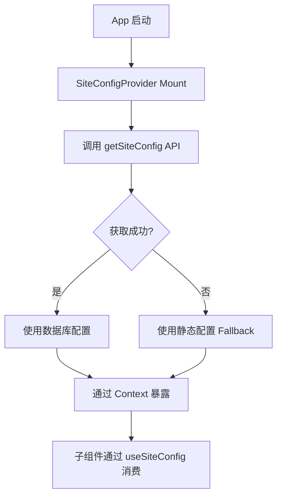

# Site Config 动态集成设计方案

**创建时间**: 2026-01-31  
**状态**: 已验证，待实现

## 背景

当前项目已在数据库中定义 `site_config` 表，包含站点标题、描述、Logo 和主题色等配置。前端已定义 `getSiteConfig()` API，但尚未实际使用。目前前端使用硬编码的静态配置（`frontend/lib/site.ts`）。

## 目标

将 `site_config` 表的四个字段集成到前端 UI 中，实现动态配置管理，同时保持静态配置作为 fallback。

## 配置字段使用场景

### 1. `site_title` - 站点标题
- `page.tsx` 第 76 行的 `<h1>` 标题（从硬编码 "Changelog" 改为动态）
- `layout.tsx` 中的 metadata title
- 浏览器标签页标题

### 2. `site_description` - 站点描述
- `metadata.ts` 中的 description（SEO）
- 可选：页面 header 下方的副标题

### 3. `logo_url` - 品牌 Logo
- 在 `page.tsx` 标题左侧显示（与文字标题配合）
- PocketBase 文件字段，需拼接完整 URL：
  ```typescript
  `${pb.baseUrl}/api/files/site_config/${config.id}/${config.logo_url}`
  ```

### 4. `primary_color` - 主题色
- 动态注入 CSS 变量 `--primary`
- 影响按钮、链接、高亮等全局 UI 元素

## 技术架构

### 方案选择：Context Provider（推荐）

**优势**：
- 全局加载一次，性能优化
- 所有子组件可通过 hook 访问
- 与现有客户端架构（`"use client"`）兼容
- 支持 fallback 降级

### 文件结构

```
frontend/
├── contexts/
│   └── site-config-context.tsx    # SiteConfig Context 和 Provider
├── lib/
│   └── hooks/
│       └── use-site-config.ts     # useSiteConfig() hook
```

### 数据流



## 关键实现细节

### 1. Logo URL 处理
在 Context 内部处理完整 URL 拼接，子组件直接使用：
```typescript
const logoUrl = config.logo_url 
  ? `${pb.baseUrl}/api/files/site_config/${config.id}/${config.logo_url}`
  : null
```

### 2. Primary Color 动态注入
通过 CSS 变量实现主题色动态切换：
```tsx
useEffect(() => {
  if (config?.primary_color) {
    document.documentElement.style.setProperty('--primary', config.primary_color)
  }
}, [config?.primary_color])
```

### 3. Fallback 机制
- **初始值**：使用 `frontend/lib/site.ts` 静态配置
- **异步加载**：后台调用 API，获取成功后静默更新
- **错误处理**：失败时降级到静态配置，console.warn 提示

### 4. Metadata 限制
Next.js 的 `metadata` 导出是静态的，无法使用客户端动态数据。因此：
- ✅ `page.tsx` 的 `<h1>` 可以动态显示
- ⚠️ `metadata.ts` 保持静态（未来可选：迁移到服务端组件）

## 改动文件清单

### 新增文件
- `frontend/contexts/site-config-context.tsx`
- `frontend/lib/hooks/use-site-config.ts`

### 修改文件
- `frontend/app/layout.tsx` - 包裹 `<SiteConfigProvider>`
- `frontend/app/page.tsx` - 使用 `useSiteConfig()` 显示动态标题和 logo
- `frontend/lib/site.ts` - 调整静态配置格式以匹配 `SiteConfig` interface

### 保持不变
- `frontend/lib/api/changelogs.ts` - `getSiteConfig()` 函数已就绪
- `frontend/app/metadata.ts` - 保持静态配置

## 验证计划

### 功能验证
1. **默认行为**：数据库无配置时，正常显示静态配置
2. **动态加载**：数据库有配置时，标题、logo、主题色正确显示
3. **错误处理**：API 失败时，应用不崩溃，降级到静态配置
4. **Logo 路径**：PocketBase 文件 URL 正确拼接和显示

### 测试步骤
1. 启动应用，检查默认状态
2. 通过 PocketBase Admin 修改 `site_config`
3. 刷新页面，验证配置生效
4. 删除配置记录，验证 fallback 机制
5. 检查浏览器控制台无错误

## 后续扩展（可选）

- 支持 favicon 动态设置
- 支持 og:image 使用 logo_url
- 迁移 metadata 到服务端组件（需重构）
- 添加配置热更新（SSE/WebSocket）
